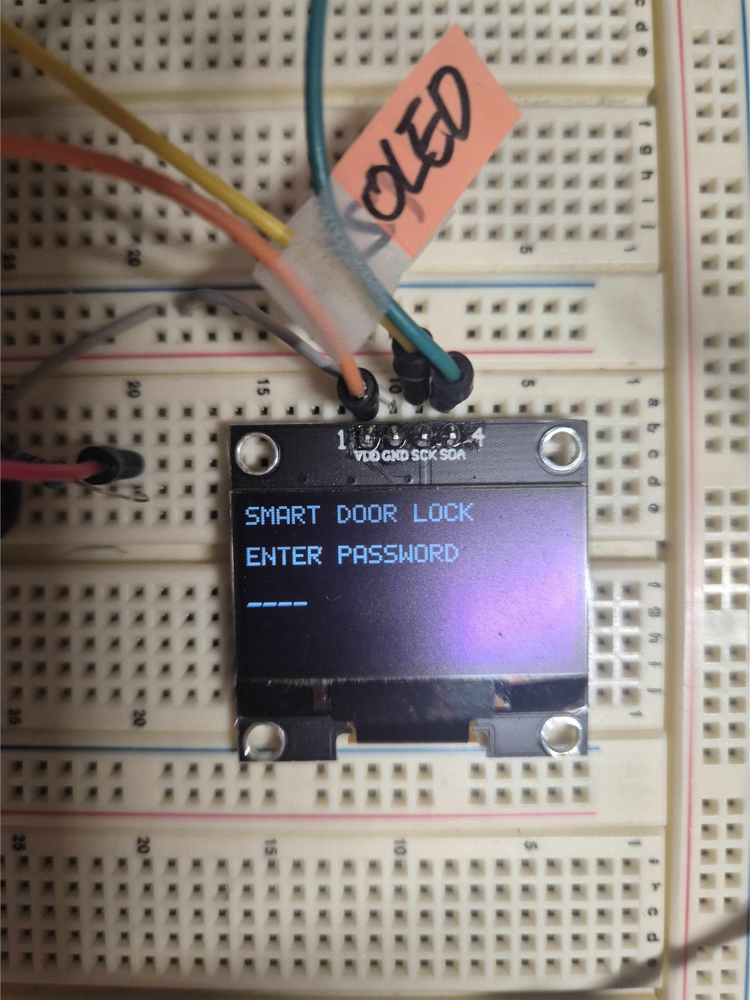
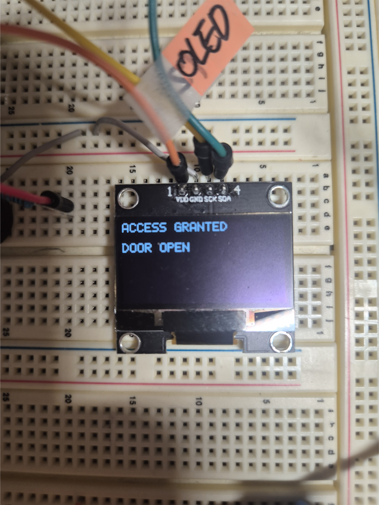
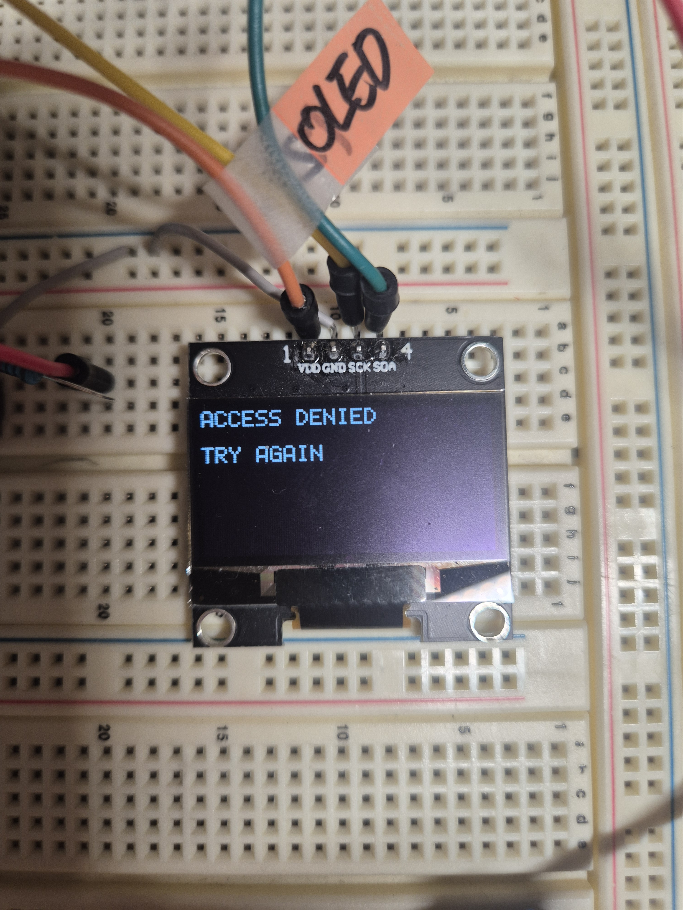
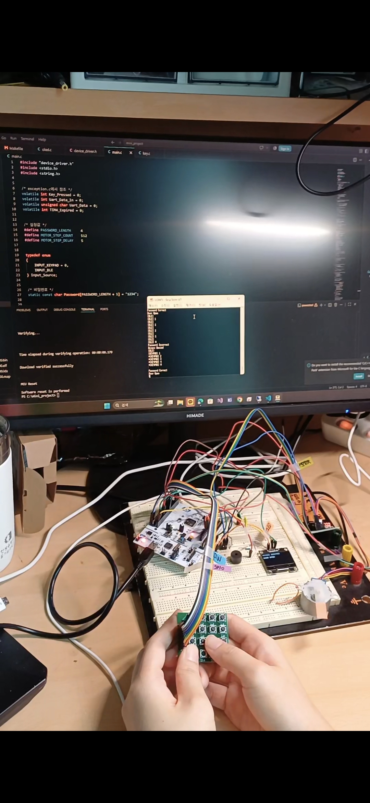
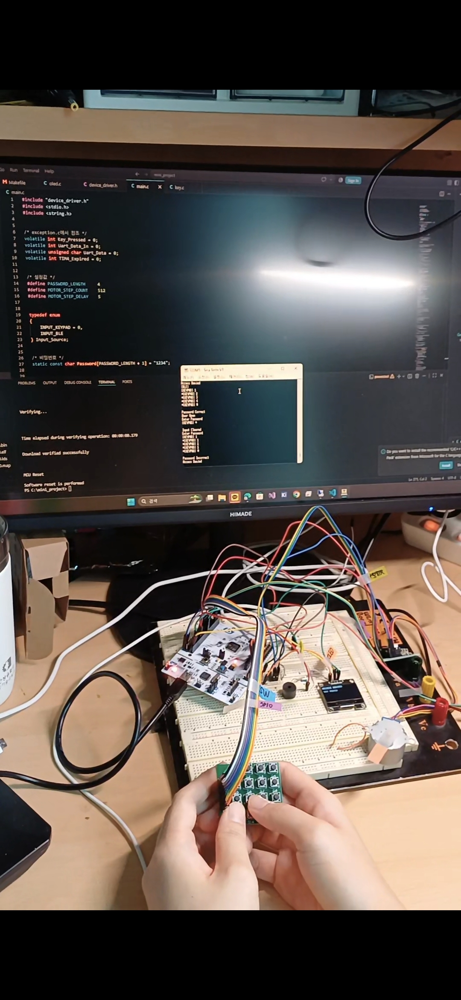
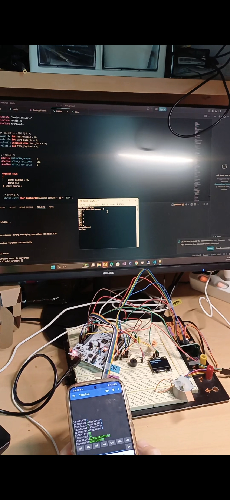
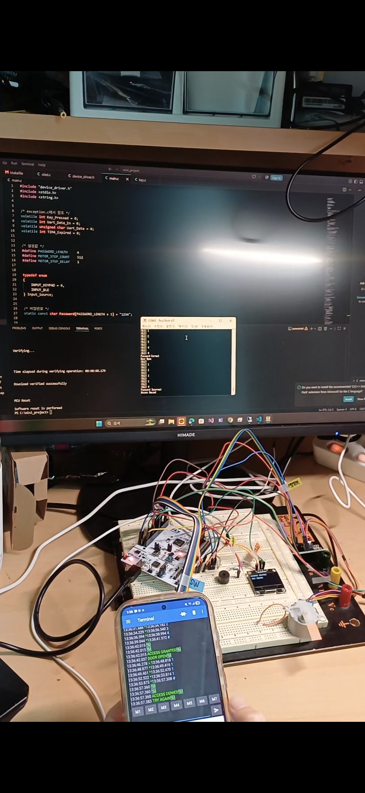

# 🔐 Smart Door Lock System

STM32F446RE를 기반으로 제작한 Smart Door Lock 프로젝트입니다.

4x4 Keypad와 BLE(HM-10)를 이용하여 비밀번호를 입력할 수 있으며,
OLED를 통해 현재 상태를 표시하고, Step Motor를 이용하여 문을 제어합니다.

---

# 📌 Project Overview

본 프로젝트는 임베디드 시스템에서 자주 사용되는 GPIO, UART, I2C를 하나의 프로젝트에 통합하여 구현하는 것을 목표로 제작하였습니다.

동일한 비밀번호 검증 로직을 Keypad와 BLE에서 공통으로 사용하도록 설계하여 입력 방식에 관계없이 동일한 동작을 수행하도록 구현하였습니다.

---

# ✨ Features

- 4x4 Matrix Keypad 입력
- HM-10 BLE 비밀번호 입력
- OLED 실시간 상태 표시
- Step Motor Door Open
- 비밀번호 성공 / 실패 판별
- Buzzer 알림
- Password Buffer 관리
- 모듈별 Driver 분리

---

# 🛠 Development Environment

MCU
- STM32F446RE

Language
- C

IDE
- Visual Studio Code

Compiler
- arm-none-eabi-gcc

Debug
- ST-Link

Communication
- UART
- I2C

---

# 🔧 Hardware

| Device | Interface |
|---------|-----------|
| STM32F446RE | Main Controller |
| SSD1306 OLED | I2C |
| HM-10 BLE | UART1 |
| 4x4 Keypad | GPIO |
| Step Motor + ULN2003 | GPIO |
| Buzzer | GPIO |

---

# 📂 Project Structure

```
Main.c
Motor.c
Keypad.c
Oled.c
I2C.c
Uart.c
Timer.c
device_driver.h
```

---

# 🔄 System Flow

```
System Start

↓

Peripheral Initialize

↓

OLED Main Screen

↓

Password Input

      │
      ├── Keypad
      │
      └── BLE

↓

Password Check

↓

Correct?
      │
      ├── YES
      │     ├── OLED : ACCESS GRANTED
      │     ├── Door Open
      │     └── Return Main Screen
      │
      └── NO
            ├── OLED : ACCESS DENIED
            ├── Buzzer
            └── Return Main Screen
```

---

# 📷 Demo

## oled 초기 화면 
## 1. 초기 상태

## 2. door open

## 3. door locked


## 제어 방법에 따른 화면 출력
## 1. key pad (gpio)

## Password Success


(사진)

## Password Fail


(사진)
## 2. Ble 통신 (USART1) 

## Password Success

(사진)


## Password Fail



# 💡 What I Learned

- GPIO를 이용한 Matrix Keypad Scan
- UART 기반 BLE 통신
- I2C를 이용한 OLED 제어
- 모듈별 Driver 분리
- Password Buffer 관리
- 사용자 인터페이스(OLED) 구현
- Bare-Metal Register Programming

---

# 🚀 Future Improvements

- OLED Driver 최적화
- Font Table 분리
- OLED Buffer 전송 최적화
- UART Driver 공통화
- SPI 기반 MCU 확장